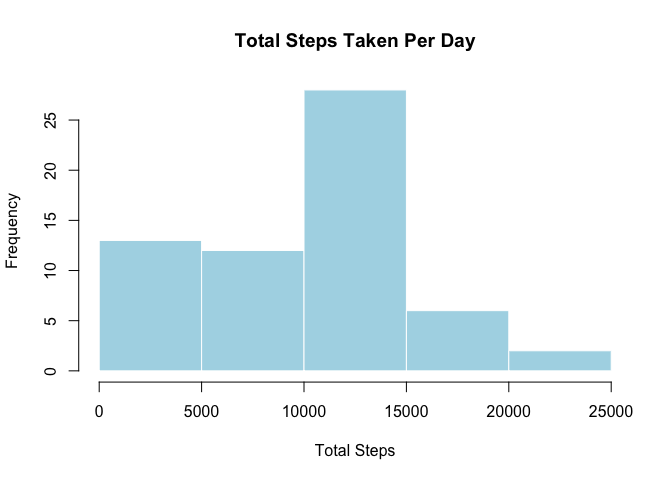
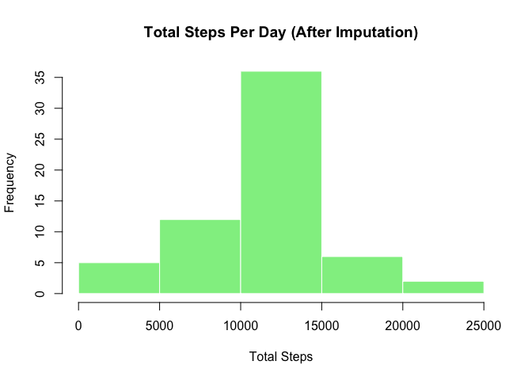
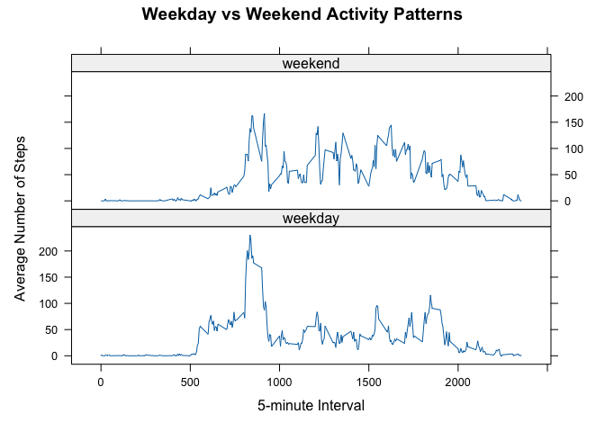

## Loading and preprocessing the data

``` r
library(dplyr)
```

```
## 
## Attaching package: 'dplyr'
```

```
## The following objects are masked from 'package:stats':
## 
##     filter, lag
```

```
## The following objects are masked from 'package:base':
## 
##     intersect, setdiff, setequal, union
```

``` r
library(lattice)

# Load data
data <- read.csv("activity.csv")

# Convert date column to Date format
data$date <- as.Date(data$date)

# Check structure
str(data)
```

```
## 'data.frame':	17568 obs. of  3 variables:
##  $ steps   : int  NA NA NA NA NA NA NA NA NA NA ...
##  $ date    : Date, format: "2012-10-01" "2012-10-01" ...
##  $ interval: int  0 5 10 15 20 25 30 35 40 45 ...
```
## What is mean total number of steps taken per day?

``` r
total_steps <- data %>% group_by(date) %>% summarise(total = sum(steps, na.rm = TRUE))

head(total_steps)
```

```
## # A tibble: 6 × 2
##   date       total
##   <date>     <int>
## 1 2012-10-01     0
## 2 2012-10-02   126
## 3 2012-10-03 11352
## 4 2012-10-04 12116
## 5 2012-10-05 13294
## 6 2012-10-06 15420
```

``` r
hist(total_steps$total,main = "Total Steps Taken Per Day",xlab = "Total Steps",col = "lightblue",border = "white")
```

<!-- -->

``` r
mean(total_steps$total)
```

```
## [1] 9354.23
```

``` r
median(total_steps$total)
```

```
## [1] 10395
```
The mean total number of steps taken per day is 9354.23 steps, while the median is 10395 steps. Since the median is higher than the mean, the distribution is slightly left-skewed, suggesting that some days had lower step counts that reduced the average.

## What is the average daily activity pattern?

``` r
avg_interval <- data %>%
  group_by(interval) %>%
  summarise(avg_steps = mean(steps, na.rm = TRUE))
plot(avg_interval$interval,avg_interval$avg_steps,type = "l",xlab = "5-minute Interval",ylab = "Average Number of Steps",main = "Average Daily Activity Pattern")
```

<!-- -->

``` r
avg_interval$interval[which.max(avg_interval$avg_steps)]
```

```
## [1] 835
```
The 5-minute interval with the highest average number of steps is 835. This indicates that peak physical activity typically occurs around this time interval during the day, suggesting a period of increased movement such as morning or midday activity.

## Imputing missing values

``` r
sum(is.na(data$steps))
```

```
## [1] 2304
```
There are 2304 missing values in the dataset.

Missing values were replaced using the mean number of steps for the corresponding 5-minute interval across all days. This approach preserves the overall daily activity pattern while avoiding bias caused by removing incomplete observations.

``` r
data_filled <- merge(data, avg_interval, by = "interval")

data_filled$steps[is.na(data_filled$steps)] <- data_filled$avg_steps[is.na(data_filled$steps)]

data_filled$avg_steps <- data_filled %>% select(-avg_steps)

total_filled <- data_filled %>% group_by(date) %>% summarise(total = sum(steps))

hist(total_filled$total,main = "Total Steps Per Day (After Imputation)",xlab = "Total Steps",col = "lightgreen",border = "white")
```

<!-- -->

``` r
mean(total_filled$total)
```

```
## [1] 10766.19
```

``` r
median(total_filled$total)
```

```
## [1] 10766.19
```
After imputing missing values, both the mean and median daily step counts increased and became nearly equal(10766.19). This indicates that missing data had reduced the original estimates. Imputing missing values provides a more accurate representation of overall daily activity.

## Are there differences in activity patterns between weekdays and weekends?

``` r
data_filled$daytype <- ifelse(weekdays(data_filled$date) %in%  c("Saturday", "Sunday"),"weekend", "weekday")

data_filled$daytype <- as.factor(data_filled$daytype)

avg_daytype <- data_filled %>% group_by(interval, daytype) %>% summarise(avg_steps = mean(steps),.groups="drop")
xyplot(avg_steps ~ interval | daytype,data = avg_daytype,type = "l",layout = c(1, 2),xlab = "5-minute Interval",ylab = "Average Number of Steps",main = "Weekday vs Weekend Activity Patterns")
```

<!-- -->
The activity patterns differ between weekdays and weekends. On weekdays, there is a sharper and more pronounced peak around the morning interval (around 835), likely reflecting structured work or school routines. In contrast, weekend activity appears more evenly distributed throughout the day, suggesting more flexible schedules and varied activity patterns.
